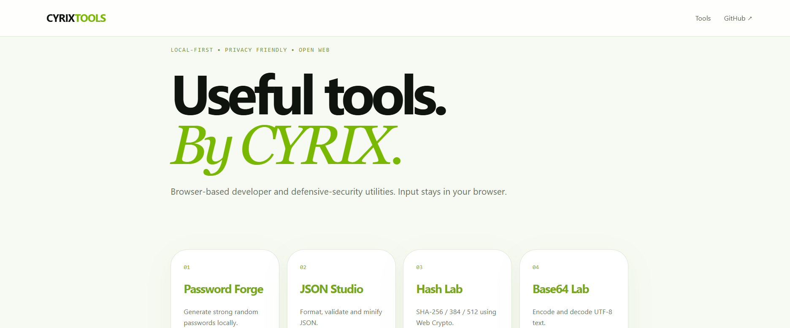
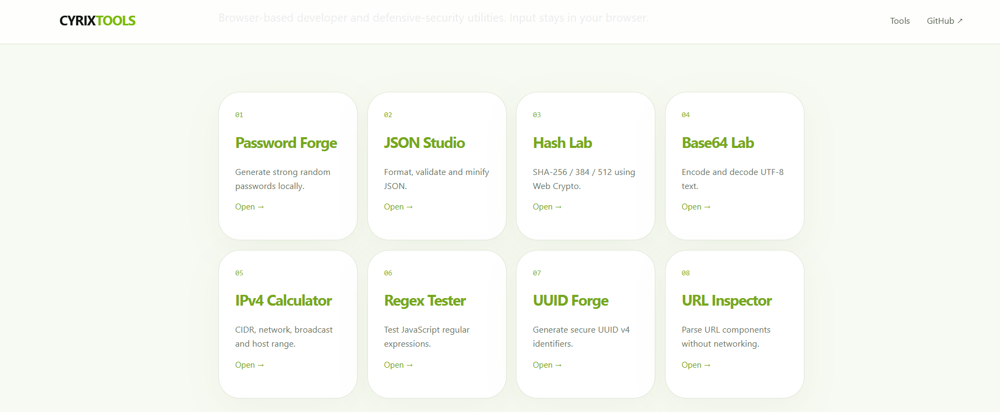

# CYRIX Tools Lab

Useful browser-side utilities ready for localhost and GitHub Pages.

**Included:** Password Forge, JSON Studio, Hash Lab, Base64 Lab, IPv4 Calculator, Regex Tester, UUID Forge, URL Inspector.

## 📸 Screenshots

  

## Localhost
Run `python -m http.server 8000` in this folder and open `http://localhost:8000`.

## GitHub Pages
Upload the files to a repository and enable Settings → Pages → Deploy from a branch.

Security/networking tools are defensive and local-only; they do not scan, attack, or send packets.
